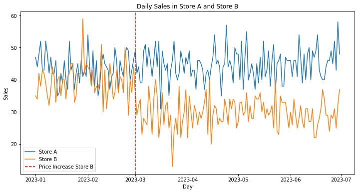
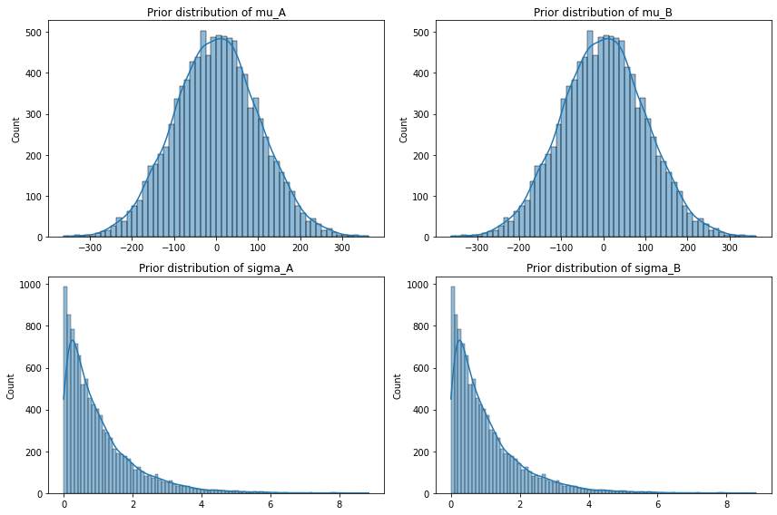
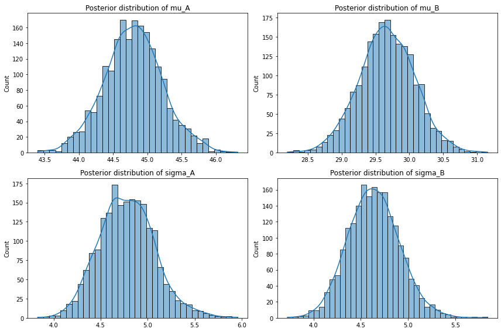
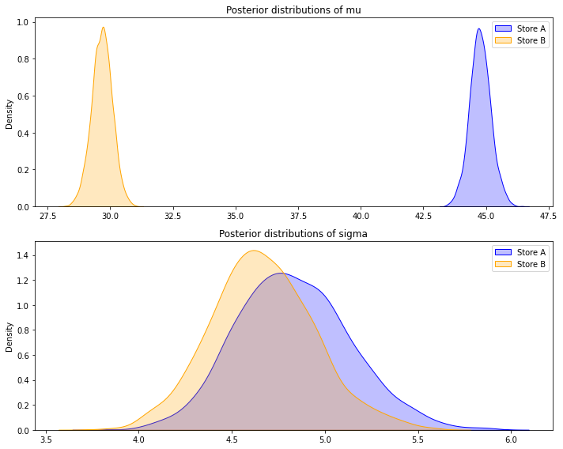

# A/B Testing in Python
> **Note** 
> - **You can find the jupyter notebook for frequentist A/B testing [here](frequentist_ab_test.ipynb)**
> - **You can find the jupyter notebook for bayesian A/B testing [here](bayesian_ab_test.ipynb)**
> - **In [here](test_bayesian_abtest_library.ipynb) jupyter notebook I test a simple the bayesian AB  testing library I created [here](src/bayesian_ab_test.py)**

A/B testing, also known as split testing or bucket testing, is a method of comparing two versions of a user experience to determine which one performs better. It is a way to test changes to your webpage against the current design and determine which one produces superior results. 
A/B testing is incredibly useful for testing changes to your user experience and making data-driven decisions. By using A/B testing, you can make careful changes to user experiences while collecting data on the results. 

## Usage
A/B testing can be used in various fields and scenarios, including but not limited to: 
- **Website design:** You can test different layouts, colors, text, and images to see what leads to better user engagement or conversion rates.
- **Marketing and email campaigns:** Test different headlines, body content, or calls to action to see what leads to higher open rates or click-through rates.
- **Product features:** If you're unsure about a new feature or change, you can test it with a subset of your users to see how it impacts their behavior.

## Types of A/B Testing
There are two main types of A/B testing: Frequentist and Bayesian. 

### Frequentist A/B Testing 
Frequentist A/B testing is the traditional method of A/B testing. It involves testing a null hypothesis and then using a p-value to decide whether to reject that null hypothesis. 

For example, if you're testing two web page designs (A and B), your null hypothesis could be that B does not improve the conversion rate compared to A. If the p-value is below a certain threshold (usually 0.05), you would reject the null hypothesis and conclude that B does improve the conversion rate. 

### Bayesian A/B Testing 
Bayesian A/B testing, on the other hand, is a probabilistic approach and it calculates the probability that one version is better than the other. 

For example, if you're testing two web page designs (A and B), Bayesian A/B testing would give you the probability that B is better than A. 

### Comparing the Two 
While both methods can be used effectively, they each have their own strengths and weaknesses. 

#### Pros and Cons of Frequentist A/B Testing 
- **Pros:** 
  - It's simple and straightforward to implement.
  - It's widely used and understood in the statistics community.
- **Cons:** 
  - It requires you to choose a significance level before running the test.
  - It doesn't tell you how much better one version is, only that one is better.

#### Pros and Cons of Bayesian A/B Testing 
- **Pros:** 
  - It gives you a probability that one version is better, which can be easier to understand.
  - It allows you to update your results as you collect more data.
- **Cons:** 
  - It can be more complex to implement.
  - It's less understood and accepted in the statistics community.

# In the code
I created two datasets and I explore different ways to determine whether the impact on sales has been relevant or not based on different A/B testing hypohtesis.

I test frequentist approaches and bayesian, testing the effect of different priors and how they are adapted in the posteriors after a few iterations.

