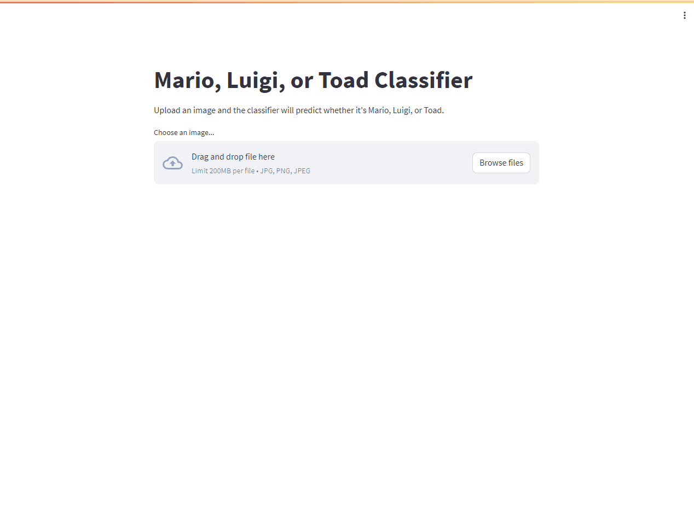
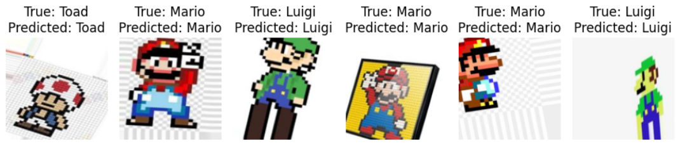
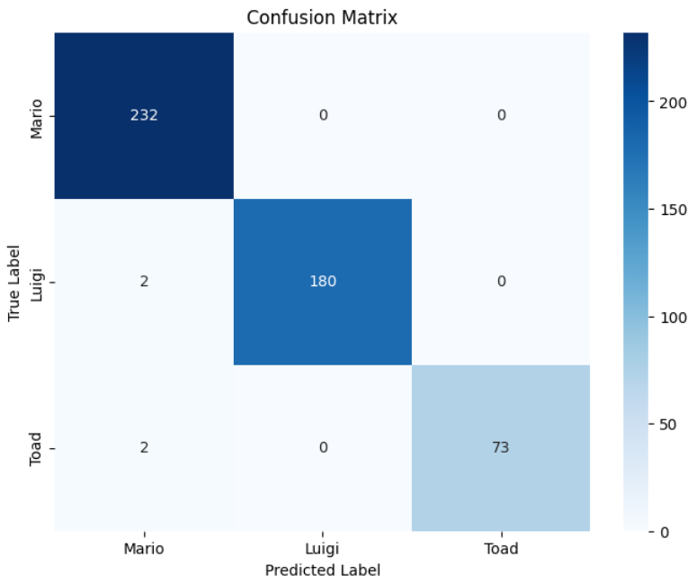
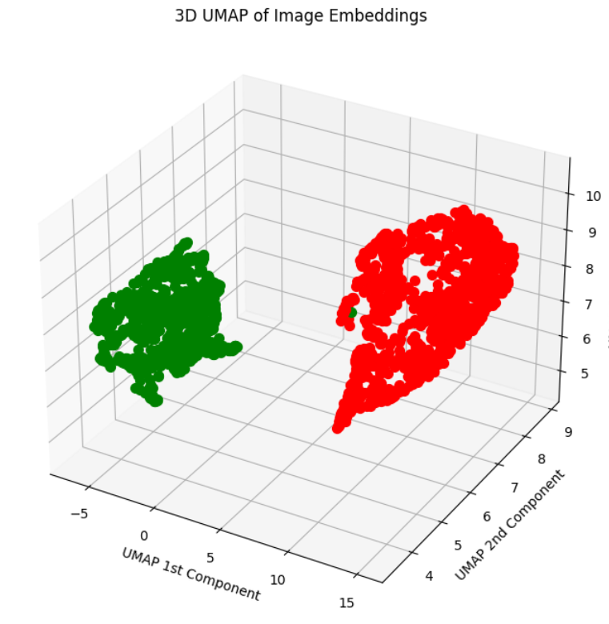
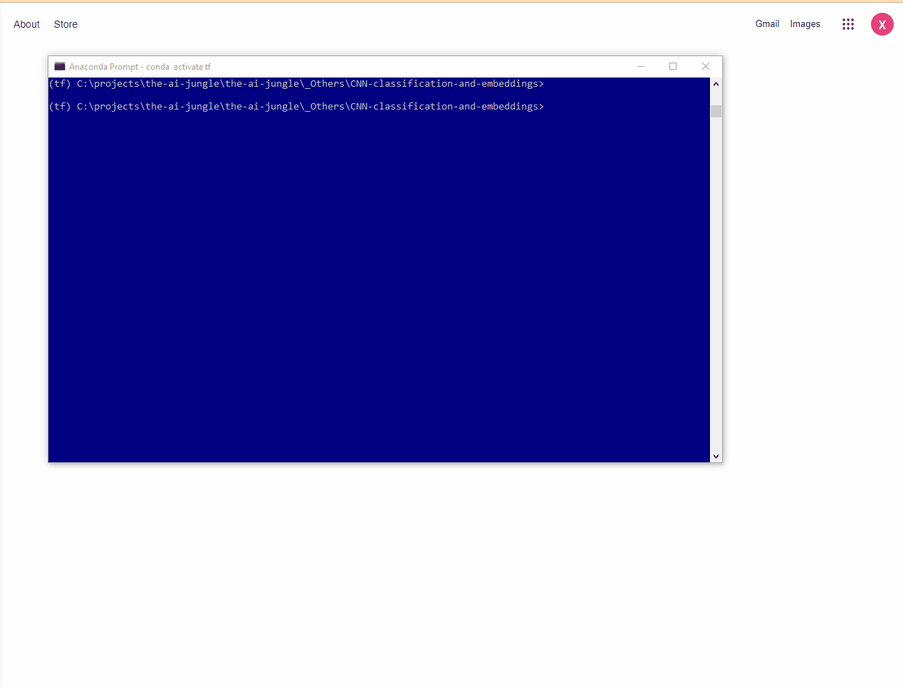

# CNN Classification and Embeddings - Classifying Mario Images

This project is a personal exploration into CNN and classification tasks. I checked various techniques to create a classifier to differentiate Mario, Luigi, and Toad images.
For this, a CNN was used,  Dropout, EarlyStopping and Normalisation techniques were used to avoid overfitting. I Followed the next steps





## Dataset Augmentation

To enhance the performance of the convolutional neural network (CNN), I augmented the dataset by introducing random transformations such as rotations, zooms, and flips. This helped in artificially increasing the dataset's size, providing a wider variety of samples for the network to learn from.


## Convolutional Neural Network (CNN)

I designed a CNN model for the task of image classification. The model distinguished between different classes, initially focusing on a binary classification between Mario and Luigi, and later expanding to include Toad. Key aspects of the model include:



- Multiple convolutional layers with max-pooling layers.
- Batch normalization and dropout for better generalization.
- Dense layers for classification, including an embedding layer for feature extraction.

The model's performance was evaluated using metrics like accuracy and was visualized using confusion matrices.





## Embeddings Exploration with UMAP

The last layer of the CNN, before the final classification layer, acted as an embedding layer, converting images into feature vectors. To understand the relationships between these embeddings, I utilized UMAP (Uniform Manifold Approximation and Projection) to reduce their dimensionality and visualize them in a 2D space. This helped in understanding how different images clustered together based on their inherent features.




## Interactive Dashboard with Streamlit

To make the project more accessible and user-friendly, I integrated a Streamlit-based dashboard. This interactive platform allows users to:

- **Upload Images**: Users can easily drag and drop images of Mario, Luigi, or Toad.
- **Visualize Predictions**: Upon uploading, the model processes the image, displaying the prediction in a vibrant, visual format. The probabilities of the image belonging to each class are also presented, color-coded for clarity.

To **launch the dashboard**, navigate to the project directory in your terminal or command prompt and run:

```
streamlit run app.py
```

This will start the Streamlit server, and the dashboard should open in your default web browser. If not, you can manually open the provided link in your browser.
The dashboard is designed to be intuitive, making the power of deep learning accessible even to those unfamiliar with the underlying complexities.




## Other Concepts Explored:

During the course of this project, I experimented with and gained insights into various deep learning concepts, including:

- **CNN (Convolutional Neural Networks)**: Explored the architecture on how convolutional layers extract features from images.
- **Image Classification**: Started with binary classification (Mario vs. Luigi) and later expanded to multiclass (Mario, Luigi, and Toad).
- **Multiclass Crossentropy**: Used as a loss function to evaluate the model's performance in multiclass classification scenarios.
- **Normalization Techniques**: Integrated various techniques such as batch normalization and L2 norm to enhance the model's training phase.
- **Dropout**: Implemented dropout layers in the network to prevent overfitting and enhance generalization.
- **EarlyStopping**: Employed the EarlyStopping callback to monitor validation accuracy and halt training when the model started overfitting.
- **Embedding Layer**: Extracted embeddings from the CNN to understand feature vectors and their relationships.
