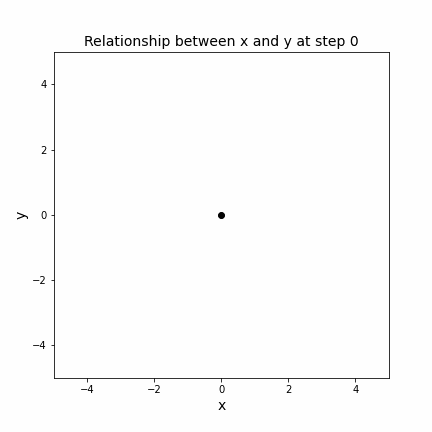

{::options parse_block_html="true" /}

# Creating Animated Visualizations with Python

You can find the jupyter notebook [here](imageio.ipynb)
{: .alert .alert-warning}

This Jupyter notebook demonstrates how to create a GIF from a series of images using Python and the libraries Matplotlib and Imageio. The concept is to plot a series of images, save those images to a directory, and then compile them into a GIF.

The first part of the code defines three lists `x`, `y`, and `time`. These lists represent a set of coordinates and corresponding time steps. A function named `create_frame(t)` is then defined which generates a plot of the path traced by the coordinates up to time `t`. This function uses Matplotlib to create the plot, then saves the plot as a PNG image in an `img` directory. The function is then called for each time step, resulting in a series of images that show the path up to each time point.

The second part of the code uses the Imageio library to compile these images into a GIF. First, it creates an array of frames by reading each image file with `imageio.imread()`. Then, it uses the `imageio.mimsave()` function to compile these frames into a GIF, specifying the output path, the frames, the duration for each frame, and the number of loops for the GIF. Finally, the GIF is displayed in the Jupyter notebook using `IPython.display.Image`.

It's important to note that the `x` and `y` lists in this example are arbitrary and serve as placeholders for the data you might want to visualize. You can replace these with your own data to visualize different paths or motions. The real power of this code is its ability to convert a sequence of images into a smooth and informative animation.

