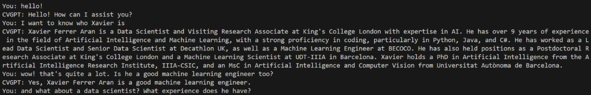

# CVGPT Project
> **Note**<br/>
> - **You can find the python script used [here](run_cvgpt.py)**
> - **Don't forget that you need access to OpenAI API**

The CVGPT project provides a way to interact with a GPT model using a given PDF document. 
In this example, I use it to query my own CV in a chat-like environment,as if I were talking to an expert who knows everything about my life.

I wrapped all this in a CVGPT class that facilitates querying the GPT model and handling the interaction, and chat_hisotry with the user.



## Video example
<iframe src='//gifs.com/embed/cvgpt-MZqMKB' frameborder='0' scrolling='no' width='1920px' height='1052px' style='-webkit-backface-visibility: hidden;-webkit-transform: scale(1);' ></iframe>

[text](https://j.gifs.com/MZqMKB.gif)


## Usage

### CVGPT Class
The `CVGPT` class is the core of the project, enabling querying of a GPT model with a given PDF document.

#### Attributes
- `pdf_path`: Path to the PDF document.
- `model_name`: Name of the GPT model to use.
- `temperature`: Temperature parameter for the GPT model.
- `chat_history`: List to keep track of the chat history.
- `documents`: Split and loaded PDF documents.
- `vectordb`: Vector database created from the documents.
- `qa`: Query chain for interacting with the GPT model.

#### Methods
- `__init__(pdf_path, model_name, temperature)`: Initializes the CVGPT object.
- `query_cvgpt(question)`: Queries the GPT model with a given question.

### Example
```python
cvgpt = CVGPT(pdf_path="path/to/pdf", model_name="gpt-model", temperature=0.7)
response = cvgpt.query_cvgpt("Who is is Xavier?")
print(response) 
```
