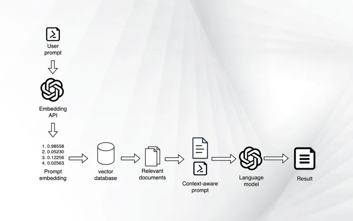

# CVGPT Project; Providing context to language models
> **Note**<br/>
> - **You can find the python script used [here](run_cvgpt.py)**
> - **Don't forget that you need access to OpenAI API**

The CVGPT project provides a way to interact with a GPT model using a given PDF document. 
In this example, I use it to query my own CV in a chat-like environment,as if I were talking to an expert who knows everything about my CV.

I wrapped all this in a CVGPT class that facilitates querying the GPT model and handling the interaction, and chat_history with the user.


## How it works
The project is structured as following
1. Loads my CV (or any other pdf document) and split its content into smaller chunks (or documents).
2. Convert these documents into embeddings using the OpenAI embeddings.
3. Store these embeddings in a database (vectordb).
4. Use a GPT model (specified by model_name) in combination with the embedded document database to answer questions.

A good explanation of the whole process can be found [here](https://bdtechtalks.com/2023/05/01/customize-chatgpt-llm-embeddings/) (the image below is from the same website). 



Basically and behind the scenes, langchain manages the following:
- The user enters a prompt
- Create the embedding for the user prompt
- Search the embedding database for the document that is nearest to the prompt embedding
- Retrieve the actual text of the document
- Create a new prompt that includes the user’s question as well as the context from the document
- Give the newly crafted prompt to the language model
- Return the answer to the user
- Bonus: provide a link to the document where the user can further obtain information


## Video example


## Usage

### CVGPT Class
The `CVGPT` class is the core of the project, enabling querying of a GPT model with a given PDF document.

#### Attributes
- `pdf_path`: Path to the PDF document.
- `model_name`: Name of the GPT model to use.
- `temperature`: Temperature parameter for the GPT model.
- `chat_history`: List to keep track of the chat history.
- `documents`: Split and loaded PDF documents.
- `vectordb`: Vector database created from the documents.
- `qa`: Query chain for interacting with the GPT model.

#### Methods
- `__init__(pdf_path, model_name, temperature)`: Initializes the CVGPT object.
- `query_cvgpt(question)`: Queries the GPT model with a given question.

### Example
```python
cvgpt = CVGPT(pdf_path="path/to/pdf", model_name="gpt-model", temperature=0.7)
response = cvgpt.query_cvgpt("Who is is Xavier?")
print(response) 
```
