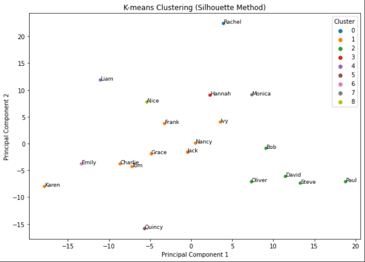

# Song Recommendation System

A recommendation system built to suggest songs to users based on their listening history. This repository is meant to be an exploration of different basic approaches, for me to test and code them. You will find:

- Code to create a test dataset
- Exploration of the dataset and Clustering, both using k-means + silhouette and elbow
- Collaborative Filtering Recommendations
- Content-Based Recommendations
- Recommendation using Matrix Factorisation

Summarizing, this project aims to recommend songs to users based on their interactions (ratings) with songs, the attributes of songs (genre, artist, length), and similarities between users.

## Outline

- [Data](#data)
- Notebooks
    - [Dataset Description ](#dataset-description )
    - [K-means Clustering](#k-means-clustering)
    - [User-User Collaborative Filtering](#user-user-collaborative-filtering)
    - [Item-Item Collaborative Filtering](#item-item-collaborative-filtering)
    - [Matrix Factorization](#matrix-factorization)
    - [Content-based Filtering](#content-based-filtering)
- [Possible Improvements](#possible-improvements)

## Data
I initially wanted to request my own playlist from `Spotify`, however, it seems it may take up to 30 days to receive the data (it's been a week already and have not heard from them yet). So instead of waiting, I created my own dataset of users, playlists and songs using the code found in the folder `src/`.

*Disclaimer: Note that at some point I will work on replacing the placeholders such as `song20` with real song names as soon as I find some free time for crawling online data.*


## Dataset Description 
The jupyter notebook [Describe Dataset](0_describe_dataset.ipynb) describes the dataset statistically, exploring genres, users and playlists.


## K-means Clustering
I group similar users and recommending songs liked by one user in a group to another in this [Clustering](1_basic_clustering.ipynb) notebook.




## User-User Collaborative Filtering
We recommend new songs to users based on user-user similarity obtained after comparing usre's playlists in this [User-User Collaborative Filtering](2_collaborative_filtering_recsys.ipynb) notebook.


## Item-Item Collaborative Filtering
Furthermore, I also explore item-item recommendation based on similarity between songs. in the [Item-Item Collaborative Filtering](2_collaborative_filtering_recsys.ipynb) notebook.

## Content-based Filtering
Here I recommend songs based on their features, such as Artist and Genre, without considering user similarities, in this [Content-based Filtering](3_content_based_recsys.ipynb)

```python
> recommend_songs('Song0', df_encoded)

240    Song240
140    Song140
50      Song50
10      Song10
230    Song230
```

## Matrix Factorization
Finally I explore a technique widely used that decomposes the user-item interaction matrix using SVD in [Matrix Factorization](4_matrix_factorisation.ipynb).

```python
> top_n_recommendations['Alice']

[('Song292', 2.439305897868699),
 ('Song253', 1.8549174882774002),
 ('Song87', 1.7108502215512469),
 ('Song7', 1.6820684334196407),
 ('Song67', 1.5834276396147273),
 ('Song272', 1.5168783496560199),
 ('Song82', 1.433099071529223),
 ('Song223', 1.3914276189153707),
 ('Song146', 1.3502125351920484),
 ('Song211', 1.320084119557865)]
```

## Possible Improvements

- Hybrid Models: Combine collaborative and content-based approaches.
- Scalability: Address scalability issues by using techniques like Stochastic Gradient Descent (SGD) or Alternating Least Squares (ALS) for Matrix Factorization.
- Incorporate Additional Features: Contextual information, song lyrics, or other user behaviors.
- Addressing Cold Start: Using content-based methods or hybrid models for new users or songs.

