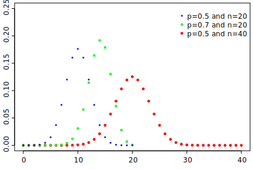
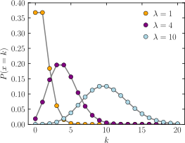

# Statistical Distributions

This small project tries to dig in generating and identifying different statistical distributions using python.
Here we have a class that, given a list of numbers, tried to disocver whether the distribution of these numbers matches one of the below distributions.

1. **Normal Distribution:** The normal distribution, also known as the Gaussian distribution, is a *continuous* probability distribution that is symmetric about the mean, showing that data near the mean are more frequent in occurrence than data far from the mean. Most of the data are concentrated within ±3 standard deviations from the mean. It is commonly used in statistics and the natural and social sciences as a simple model for complex random variables.

    Example: If you measure the height of all the individuals in a population, you'll see that it follows a normal distribution, i.e., most individuals are of average height, while a small proportion is either very tall or very short.

    </br>

2. **Binomial Distribution:** The binomial distribution is a *discrete* probability distribution of the number of successes in a sequence of n independent experiments. It is characterized by two parameters: the number of trials (n) and the probability of success in an individual trial (p).

    Example: A typical example of a binomial distribution is a coin toss, where each toss (trial) is independent and has a probability of success (getting a head) of 0.5.

    </br>

3. **Uniform Distribution:** *Can be both discrete and continuous*. In a uniform distribution, all values have the same frequency (i.e., all values are equally likely to occur). The distribution is completely characterized by two parameters: the minimum and maximum values.

    Example: The probability distribution of a dice roll is uniform because each side (1,2,3,4,5,6) has an equal chance (1/6) of occurring.

    </br>

4. **Poisson Distribution:** The Poisson distribution is a *discrete* probability distribution that expresses the probability of a given number of events occurring in a fixed interval of time or space, with a fixed average rate of occurrence, and independently of the time since the last event.

    Example: The number of phone calls received by a call center per hour follows a Poisson distribution, with the average number of calls typically being constant.

    </br>

5. **Exponential Distribution:** The exponential distribution is a *continuous* distribution based on the probability distribution of the time between events in a Poisson point process (a process in which events occur continuously and independently at a constant average rate). It has a parameter λ called rate parameter.

    Example: The amount of time you need to wait for the next bus at a bus stop follows an exponential distribution, assuming the buses have a constant average arrival rate and are independent of when the previous bus arrived.
    
    </br>

6. **Beta Distribution:** The beta distribution is a family of *continuous* probability distributions defined on the interval [0, 1] parametrized by two positive shape parameters, denoted by α and β, that appear as exponents of the random variable and control the shape of the distribution.

    Example: The beta distribution can be used to model the distribution of random variables that represent proportions or percentages. For instance, it could model the proportion of time someone spends watching television per day.

    </br>

In each of these cases, the statistical class created can check whether a given dataset likely originated from one of these distributions. It's important to note, however, that these checks are heuristic and have limitations. Real-world data is often noisy and may not perfectly fit these idealized distributions.


# Continuity correction
Continuity correction is often applied when you're using a continuous distribution (like the normal distribution) to approximate a discrete distribution (like the binomial or Poisson distribution). Since the continuous distribution includes values that the discrete distribution cannot assume, we adjust or "correct" for this continuity discrepancy.

Here is an example:

Let's say we are flipping a fair coin 100 times (so we have a binomial distribution with n=100, p=0.5), and we want to find the probability that we get exactly 60 heads. Since 60 is a discrete number of heads, this event is a perfect question for the binomial distribution. However, suppose we want to use the normal distribution to approximate this probability.

The corresponding normal distribution will have a mean of np = 100 * 0.5 = 50 and a standard deviation of sqrt(np(1-p)) = sqrt(100 * 0.5 * 0.5) = 5. 

If we were not using continuity correction, we would simply find the z-score for X=60 and find the corresponding probability from the normal distribution. However, because we are trying to find the probability of exactly 60 (not a range), and we're moving from a discrete to continuous distribution, we need to apply a continuity correction.

To find the probability of getting exactly 60 heads, we look for the probability of getting between 59.5 and 60.5 heads (because these are the boundaries around 60 when we move to a continuous scale). 

Therefore, instead of finding P(X = 60), we find P(59.5 < X < 60.5) when using the normal distribution. This is a more accurate approximation of the original discrete probability from the binomial distribution.

Note: When using the normal distribution to approximate a binomial distribution, the approximation works better for larger values of n, and when p is not too close to 0 or 1. A common rule of thumb is the approximation is reasonable if np > 5 and n(1-p) > 5.

# Drawing from a distribution

Yes, generating examples that follow a specific distribution depends on the type of distribution. Many programming languages, including Python, provide libraries with functions to generate random numbers according to various distributions.

In Python, the NumPy library and the SciPy library have functions for generating random numbers from many common probability distributions.

Here are some examples:

1. **Normal distribution:** The `numpy.random.normal()` function generates random numbers according to a normal distribution. You specify the mean and standard deviation of the distribution.

    ```python
    import numpy as np
    data = np.random.normal(loc=0.0, scale=1.0, size=1000)  # loc is the mean, scale is the standard deviation, size is the number of samples
    ```

2. **Binomial distribution:** The `numpy.random.binomial()` function generates random numbers from a binomial distribution. You specify the number of trials and the probability of success.

    ```python
    data = np.random.binomial(n=10, p=0.5, size=1000)  # n is the number of trials, p is the probability of success, size is the number of samples
    ```

3. **Uniform distribution:** The `numpy.random.uniform()` function generates random numbers from a uniform distribution.

    ```python
    data = np.random.uniform(low=0.0, high=1.0, size=1000)  # low is the minimum possible value, high is the maximum, size is the number of samples
    ```

4. **Poisson distribution:** The `numpy.random.poisson()` function generates random numbers from a Poisson distribution. You specify the rate (lambda) of the distribution.

    ```python
    data = np.random.poisson(lam=5.0, size=1000)  # lam is the rate, size is the number of samples
    ```

5. **Exponential distribution:** The `numpy.random.exponential()` function generates random numbers from an exponential distribution. You specify the scale (1/lambda) of the distribution.

    ```python
    data = np.random.exponential(scale=1.0, size=1000)  # scale is 1/lambda, size is the number of samples
    ```

6. **Beta distribution:** The `numpy.random.beta()` function generates random numbers from a beta distribution. You specify the alpha and beta parameters of the distribution.

    ```python
    data = np.random.beta(a=2.0, b=5.0, size=1000)  # a and b are shape parameters, size is the number of samples
    ```
These functions can generate as many samples as you need by changing the `size` parameter. The larger the size, the more closely the histogram of the data will match the shape of the theoretical distribution.