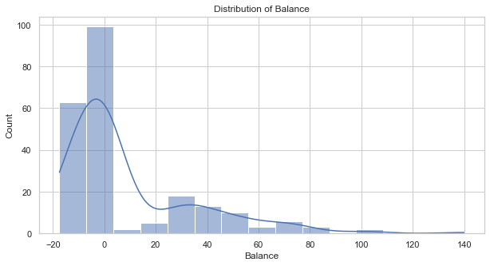
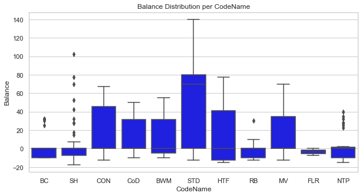
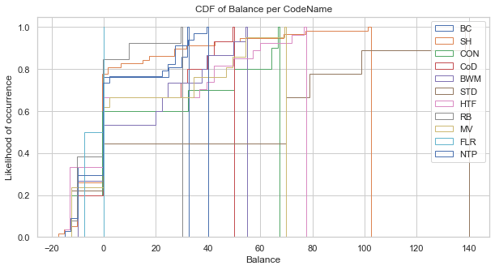
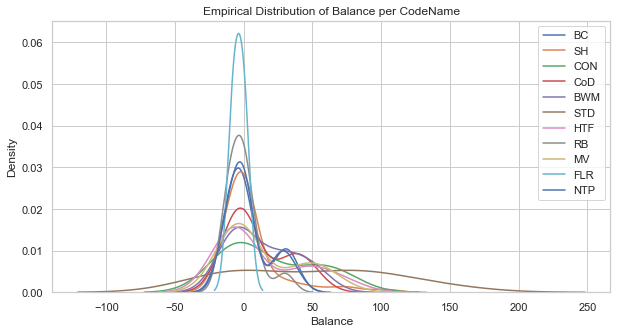
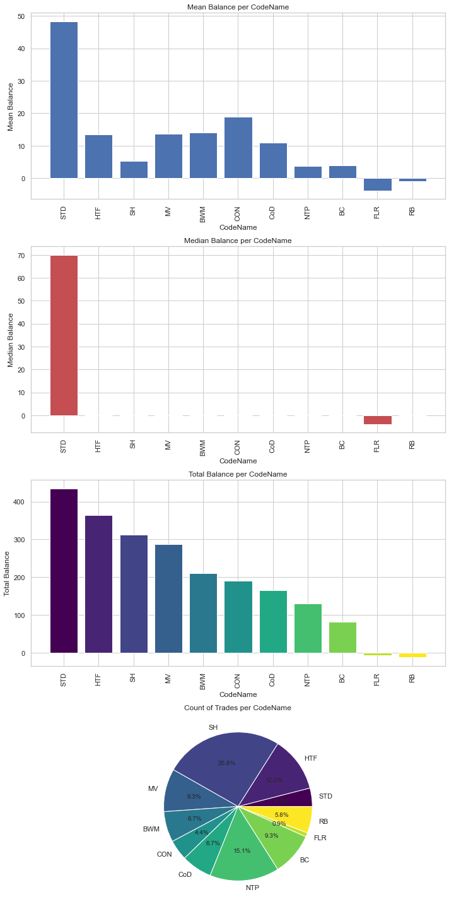
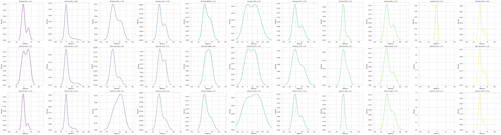

Sure, I'll create a README file. 

---

# Trading Stats
The `TradeAnalyzer` class is a Python class that I created to explore the live trades made by a bot I programmed. This helps me get a clear picture of the behaviour of the bot and it's performance, and show me wether there has been any problem or data drift recently to identify types of trades that used to be net positive before but no longer do.

It allows for comprehensive analysis of a given dataset with a specific format consistent of different trades and their results. This class provides several methods for cleaning, preprocessing, and analyzing the data. It is especially useful for analyzing trading datasets, with a focus on the `Balance` and `CodeName` variables.

> Requirements
> A big chunk of the anlaysis is performed by pivoting around the type of trade `CodeName` and the month to explore drifting. Take a look at the original dataset to see what columns are necessary.

## Getting Started
To get started with `TradeAnalyzer`, you need to import the class into your Python environment. Once the class is imported, you can create an instance of the class with your DataFrame.

```python
df = pd.read_csv("data/Stats.csv", sep=';')
df.drop('ExitPrice', axis=1, inplace=True)
df.head()

# Define the columns
numerical_columns = ['Balance', 'MaxBalance', 'Length', 'EntryPrice']
categorical_columns = ['CodeName', 'IsLong']
time_column = 'OpenTradeDatetime'

# Create an instance of TradeAnalyzer
analyzer = TradeAnalyser(df, numerical_columns, categorical_columns, time_column)

# Specify which analyses to perform
analyses_config = {
    "handle_outliers"                               : False,
    "correlation_analysis"                          : False,
    "time_series_analysis"                          : False,
    "handle_missing_values"                         : True,
    "descriptive_statistics"                        : True,
    "distribution_variables"                        : True,
    "balance_per_codeName"                          : True,
    "balance_cdf_per_codename"                      : True,
    "empirical_distribution_per_codename"           : True,
    "codename_performance_analysis"                 : True,
    "empirical_distribution_per_codename_full"      : True
}

# Run the analyze function
analyzer.analyze(analyses_config, missing_values_strategy='mean')
```

Here, `df` is a pandas DataFrame containing your dataset, and `time_column` is the name of the column containing the datetime information (default is 'OpenTradeDatetime').
The rest of columns are self-explanatory.

## Handling Missing Values and Outliers
`TradeAnalyzer` provides methods to handle missing values and outliers in your dataset:

```python
analyzer.handle_missing_values(strategy='mean')
analyzer.handle_outliers(strategy='iqr')
```
`handle_missing_values` replaces missing values in the dataset according to the `strategy` parameter: 'mean', 'median', or 'mode'. 
`handle_outliers` removes outliers in the dataset according to the `strategy` parameter: 'iqr' (interquartile range), 'zscore', or 'mad' (median absolute deviation). 

## Analyzing the Data
`TradeAnalyzer` provides an `analyze` method that performs a series of analyses on the dataset. The analyses to be performed can be configured with a dictionary:

```python
analyses_config = {
    "handle_outliers"                               : False,
    "correlation_analysis"                          : False,
    "time_series_analysis"                          : False,
    "handle_missing_values"                         : True,
    "descriptive_statistics"                        : True,
    "distribution_variables"                        : True,
    "balance_per_codeName"                          : True,
    "balance_cdf_per_codename"                      : True,
    "empirical_distribution_per_codename"           : True,
    "codename_performance_analysis"                 : True,
    "empirical_distribution_per_codename_full"      : True
}

analyzer.analyze(analyses_config, missing_values_strategy='mean', outliers_strategy='iqr')
```
The `analyze` method then performs each of the analyses specified in the `analyses_config` dictionary.

## Visualization
The `analyze` method creates several visualizations, which can help in understanding the distribution and trends of the data. These visualizations include:
- Histograms and box plots of numeric variables
- Count plots of categorical variables
- Distribution of `Balance` per `CodeName`
- Empirical distribution of `Balance` for each `CodeName`
- Performance ranking of each `CodeName`

All figures are displayed inline and can be further customized using matplotlib and seaborn.


## Example Analysis






